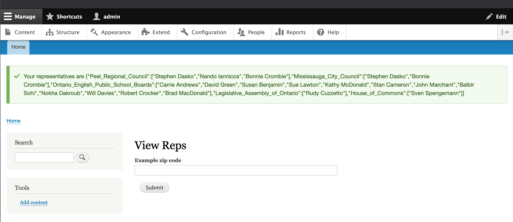

#### New/Mode Code Test

When writing the code test, please keep in mind best programming practices as well as proper coding style and the Drupal community’s PHP and JavaScript coding standards.
Specifications

Write a small web application that allows end users to enter a Canadian postal code and view a list of political representatives associated with that postal code.
Data should be pulled from the Open North Represent API (http://represent.opennorth.ca/api/). Representatives should be presented in a table or list ordered by ‘representative set’ (as found via the Represent API using this end point http://represent.opennorth.ca/postcodes).

### Specs

[x] The implementation should be a small Drupal 9 module that implements Drupal’s form API.
[] Include caching wherever applicable to improve the application’s performance.
[] The code does not need to be perfect, but it should be considered production ready. We estimate this to take approximately 5 hours.

[x] All PHP, JavaScript, etc. needed to install, configure, and use the module or application.
[x] Attach screenshots of the form.
[x] Compress everything in a tarball or commit it to a github repo.

### Notes
Overall, this coding challenge was a struggle for me. Having never used Drupal before, finding the resources and adapting them to the work that needed to be completed took a lot of work.  As it currently exists, the app, when used within MAMP, can get and aggregate the representative data by postal code.  The data is manipulated to group by representative sets, creating an object in which the representative sets are keys who's values are arrays of representatives that belong to those sets.

#### The Process
Day 1:  The day started by trying to learn the basic concepts behind the Drupal framework and the reasons for its design. After a half day of consuming informational videos, docs, and tutorials, I began by setting my sites on getting a site using Drupal up and running.
I originally set out to use Docker for hosting my server locally. Having other projects run on Docker, I am fairly comfortable using it to host severs locally.  The docs recommended a tool called DDEV, which seemed like the right direction to be heading in, the tool's docs had a quick start guide for Drupal 9 -- documentation including caveats to this new version seem to be few and far between.
After learning that Drupal gets installed after the server (duh) I had a server that was set up and ready to go.
After going through the installer, I began learning about custom modules and started to create a skeleton of files I would want to use to fulfill the requirements.  It looked like I would want a form that would extend the FormBase class.  Cool.

Day 2: The next day, I followed the Hello World tutorial for creating custom modules.  My plan was to iterate upon this simple custom module example: switching from a controller to a form, hooking up the form's submit to the opennorth API, collecting and grouping the data correctly, implementing a table to display the data, creating the cache and defining its conditions, and then if I had time, I would work on cosmetics.
However, I discovered that after installing the custom module through the GUI, any attempt to access the new form endpoint would give a server error of 'Transport endpoint is not connected.'  A couple hours were sunk into trying to debunk this before investigating another solution for local hosting.  At this point, I switched to MAMP (and accidentally MAMP Pro for 30 minutes as the download page directed me there first 🤦‍♂️) and after a while, was successfully back up and running, with the ability to hit the form endpoint without error.  The form was easily wired up to send out a request to the opennorth API using PHP's cURL and retrieving and regrouping the data by representative set was complete.
The next challenge is where I still am currently.  The form does not offer a way to render extra HTML, so I began to explore using blocks. This however did not use the form API as was instructed, so I had to return to using the form.  An attempt to utilize themes ultimately proved nothing.

-----

CONTENTS OF THIS FILE
---------------------

 * About Drupal
 * Configuration and features
 * Installation profiles
 * Appearance
 * Developing for Drupal
 * More information

ABOUT DRUPAL
------------

Drupal is an open source content management platform supporting a variety of
websites ranging from personal weblogs to large community-driven websites. For
more information, see the Drupal website at https://www.drupal.org, and join
the Drupal community at https://www.drupal.org/community.

Legal information about Drupal:
 * Know your rights when using Drupal:
   See LICENSE.txt in the "core" directory.
 * Learn about the Drupal trademark and logo policy:
   https://www.drupal.com/trademark

CONFIGURATION AND FEATURES
--------------------------

Drupal core (what you get when you download and extract a drupal-x.y.tar.gz or
drupal-x.y.zip file from https://www.drupal.org/project/drupal) has what you
need to get started with your website. It includes several modules (extensions
that add functionality) for common website features, such as managing content,
user accounts, image uploading, and search. Core comes with many options that
allow site-specific configuration. In addition to the core modules, there are
thousands of contributed modules (for functionality not included with Drupal
core) available for download.

More about configuration:
 * Install, update, and maintain Drupal:
   See INSTALL.txt and UPDATE.txt in the "core" directory.
 * Learn about how to use Drupal to create your site:
   https://www.drupal.org/documentation
 * Follow best practices:
   https://www.drupal.org/best-practices
 * Download contributed modules to /modules to extend Drupal's functionality:
   https://www.drupal.org/project/project_module
 * See also: "Developing for Drupal" for writing your own modules, below.

INSTALLATION PROFILES
---------------------

Installation profiles define additional steps (such as enabling modules,
defining content types, etc.) that run after the base installation provided
by core when Drupal is first installed. There are two basic installation
profiles provided with Drupal core.

Installation profiles from the Drupal community modify the installation process
to provide a website for a specific use case, such as a CMS for media
publishers, a web-based project tracking tool, or a full-fledged CRM for
non-profit organizations raising money and accepting donations. They can be
distributed as bare installation profiles or as "distributions". Distributions
include Drupal core, the installation profile, and all other required
extensions, such as contributed and custom modules, themes, and third-party
libraries. Bare installation profiles require you to download Drupal Core and
the required extensions separately; place the downloaded profile in the
/profiles directory before you start the installation process.

More about installation profiles and distributions:
 * Read about the difference between installation profiles and distributions:
   https://www.drupal.org/docs/distributions/creating-distributions
 * Download contributed installation profiles and distributions:
   https://www.drupal.org/project/project_distribution
 * Develop your own installation profile or distribution:
   https://www.drupal.org/docs/distributions/creating-distributions

APPEARANCE
----------

In Drupal, the appearance of your site is set by the theme (themes are
extensions that set fonts, colors, and layout). Drupal core comes with several
themes. More themes are available for download, and you can also create your own
custom theme.

More about themes:
 * Download contributed themes to /themes to modify Drupal's appearance:
   https://www.drupal.org/project/project_theme
 * Develop your own theme:
   https://www.drupal.org/docs/theming-drupal

DEVELOPING FOR DRUPAL
---------------------

Drupal contains an extensive API that allows you to add to and modify the
functionality of your site. The API consists of "hooks", which allow modules to
react to system events and customize Drupal's behavior, and functions that
standardize common operations such as database queries and form generation. The
flexible hook architecture means that you should never need to directly modify
the files that come with Drupal core to achieve the functionality you want;
instead, functionality modifications take the form of modules.

When you need new functionality for your Drupal site, search for existing
contributed modules. If you find a module that matches except for a bug or an
additional needed feature, change the module and contribute your improvements
back to the project in the form of a "patch". Create new custom modules only
when nothing existing comes close to what you need.

More about developing:
 * Search for existing contributed modules:
   https://www.drupal.org/project/project_module
 * Contribute a patch:
   https://www.drupal.org/patch/submit
 * Develop your own module:
   https://www.drupal.org/developing/modules
 * Follow programming best practices:
   https://www.drupal.org/docs/develop/standards
 * Refer to the API documentation:
   https://api.drupal.org/api/drupal/9
 * Learn from documented Drupal API examples:
   https://www.drupal.org/project/examples

MORE INFORMATION
----------------

 * See the Drupal.org online documentation:
   https://www.drupal.org/documentation

 * For a list of security announcements, see the "Security advisories" page at
   https://www.drupal.org/security (available as an RSS feed). This page also
   describes how to subscribe to these announcements via email.

 * For information about the Drupal security process, or to find out how to
   report a potential security issue to the Drupal security team, see the
   "Security team" page at https://www.drupal.org/drupal-security-team

 * For information about the wide range of available support options, visit
   https://www.drupal.org and click on Community and Support in the top or
   bottom navigation.
